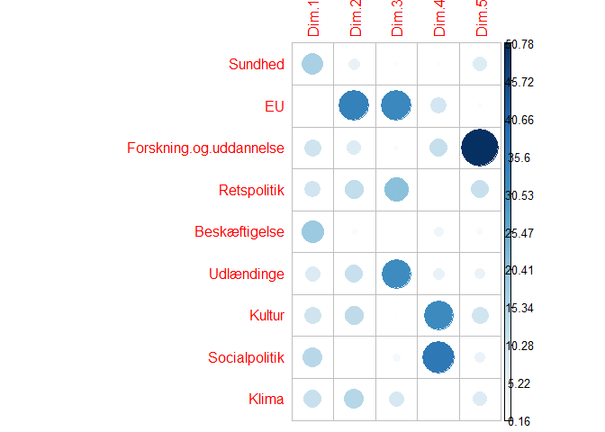

PCA dkpolopbrud
================

Dansk politik i opbrud? Nye akser for danske politiske partier
--------------------------------------------------------------

Denne korte guide viser, hvordan man i R kan analysere og visualisere de danske politiske partiers holdninger ved brug af PCA, principalkomponentanalyse.

"Det politiske spektrum" har en lang historie, men finder sit mest almindelige udtryk i dagligdagens "højrefløjen", "venstrefløjen", "blå blok" eller "rød blok".

Virkeligheden er væsentligt mere nuanceret, men af forskellige årsager kan vi have en interesse i, analytisk eller retorisk, at se på de politiske partier som fordelt på simple akser.

PCA er en metode, der tillader analytikeren at summere og visualisere datasæt med mange variabler og observationer på en enkel, overskuelig måde. Kort sagt kan vi via PCA identificere de væsentligste variabler, der adskiller forskellige individer eller grupper (her: partier), og udtrykker dem i nye variabler, kaldet hoved-komponenter eller 'dimensioner'.

I denne analyse tager jeg udgangspunkt i variabler for de ni nuværende partier i Folketinget (Alternativet, Dansk Folkeparti, Det Konservative Folkepartie, Enhedslisten, Liberal Alliance, Radikale Venstre, Socialistisk Folkepartier, Socialdemokratiet og Venstre) fra Dagbladet Informations serie "Dansk politik er i opbrud – hvor står partierne?". I serien, der har kørt over sommeren, kortlægger eksperter på en skala fra 1 til 10 alle ni partier på ni forskellige politiske akser: klimapolitik, socialpolitik, kulturpolitik, udlændingepolitik, forsknings- samt uddannelsespolitik, sundhedspolitik, EU-politik, beskæftigelsespolitik og retspolitik. [Serien kan læses her](https://www.information.dk/serie/dansk-politik-opbrud-staar-partierne).

Langt hoveddelen af koden her kommer fra [Alboukadel Kassambaras glimrende PCA-introduktion](http://www.sthda.com/english/articles/31-principal-component-methods-in-r-practical-guide/112-pca-principal-component-analysis-essentials/).

------------------------------------------------------------------------

### Forberedelse

#### Indsamling af data

Først har jeg samlet Informations score (1-10) for hvert parti for hver politisk akse i ét samlet dokument, der findes i mappen her: dkpolopbrud.csv.

#### Indlæsning af data

``` r
data <- read.csv("data/dkpolopbrud.csv", sep=";",row.names=1)
data
```

    ##                   Sundhed  EU Forskning.og.uddannelse Retspolitik
    ## Alternativet          1.5 6.5                    4.25        5.00
    ## Enhedslisten          2.0 2.0                    3.00        2.50
    ## SF                    2.5 8.5                    3.00        5.25
    ## Socialdemokratiet     3.5 7.0                    4.00        7.25
    ## DF                    3.5 2.5                    2.50        9.00
    ## Radikale              5.0 9.5                    2.50        3.50
    ## Venstre               6.0 7.0                    7.00        7.50
    ## De Konservative       6.5 5.5                    5.50        8.25
    ## Liberal Alliance      7.5 4.5                    6.00        6.50
    ##                   Beskæftigelse Udlændinge Kultur Socialpolitik Klima
    ## Alternativet               2.00       3.25   2.25          5.25  2.00
    ## Enhedslisten               1.00       3.50   4.25          2.00  4.25
    ## SF                         3.00       7.25   5.00          2.50  3.50
    ## Socialdemokratiet          3.75       8.00   5.25          4.25  3.25
    ## DF                         5.00       9.50   2.50          6.50  9.00
    ## Radikale                   5.00       4.50   4.25          6.00  3.00
    ## Venstre                    7.50       8.00   6.50          7.00  6.25
    ## De Konservative            7.00       8.25   6.50          6.50  5.50
    ## Liberal Alliance           9.50       6.50   7.50          9.25  9.75

``` r
attach(data)
```

#### Installation af krævede pakker

Til brug for PCA'en anvender vi pakkerne FactoMineR, factoextra og corrplot.

``` r
install.packages(c("FactoMineR", "factoextra","corrplot"))
```

------------------------------------------------------------------------

### PCA og visualisering

#### PCA-elementet

Først generer vi selve PCA-elementet via funktionen PCA(). Hertil skal vi blot bruge vores data-element, og vi undlader for nu at se på den medfølgende graf. Efterfølgende kan vi printe (print) PCA-elementet, hvilket giver os en oversigt over de objekter, der er tilgængelige til videre analyse.

``` r
library("FactoMineR")
res.pca <- PCA(data, graph = FALSE)
print(res.pca)
```

    ## **Results for the Principal Component Analysis (PCA)**
    ## The analysis was performed on 9 individuals, described by 9 variables
    ## *The results are available in the following objects:
    ## 
    ##    name               description                          
    ## 1  "$eig"             "eigenvalues"                        
    ## 2  "$var"             "results for the variables"          
    ## 3  "$var$coord"       "coord. for the variables"           
    ## 4  "$var$cor"         "correlations variables - dimensions"
    ## 5  "$var$cos2"        "cos2 for the variables"             
    ## 6  "$var$contrib"     "contributions of the variables"     
    ## 7  "$ind"             "results for the individuals"        
    ## 8  "$ind$coord"       "coord. for the individuals"         
    ## 9  "$ind$cos2"        "cos2 for the individuals"           
    ## 10 "$ind$contrib"     "contributions of the individuals"   
    ## 11 "$call"            "summary statistics"                 
    ## 12 "$call$centre"     "mean of the variables"              
    ## 13 "$call$ecart.type" "standard error of the variables"    
    ## 14 "$call$row.w"      "weights for the individuals"        
    ## 15 "$call$col.w"      "weights for the variables"

#### Variablers varians

En første interessant ting, vi kan kigge på, er de variansen eller 'eigenvalues' for hvert af de hovedkomponenter (dimensions), som PCA'en har genereret. Her bruger vi get\_eigenvalue().

``` r
library("factoextra")
```

    ## Loading required package: ggplot2

    ## Welcome! Related Books: `Practical Guide To Cluster Analysis in R` at https://goo.gl/13EFCZ

``` r
eig.val <- get_eigenvalue(res.pca)
eig.val
```

    ##        eigenvalue variance.percent cumulative.variance.percent
    ## Dim.1 5.086482089      56.51646765                    56.51647
    ## Dim.2 1.632230205      18.13589117                    74.65236
    ## Dim.3 1.068898359      11.87664844                    86.52901
    ## Dim.4 0.633874710       7.04305233                    93.57206
    ## Dim.5 0.464826988       5.16474431                    98.73680
    ## Dim.6 0.089740034       0.99711149                    99.73392
    ## Dim.7 0.021287424       0.23652693                    99.97044
    ## Dim.8 0.002660191       0.02955768                   100.00000

Her kan vi se, at den første dimension forklarer 56,5% af variansen i vores data. For de to første dimensioner, er det 74,6%; for de tre førstedimensioner, 86,5%, og så fremdeles. Som hovedregel er vi mest interesseret i de hovedkomponenter (dimensioner), som fortæller os mest om forskellene mellem vores observationer, dvs. her forklarer mest varians mellem partiernes placering på de ni politiske akser.

Vi kan også visualisere variansen med et såkaldte 'scree plot' (via fviz\_eig()), der giver os dimensionerne rangerer fra højest til lavest varians - via funktionen fviz\_eig(). I koden tilføjer vi labels for de enkelte datapunkter og definerer y-aksen som mellem 0 og 60 (da vores største værdi er 56,5).

``` r
fviz_eig(res.pca, addlabels = TRUE, ylim = c(0, 60))
```


#### Variabler og hovedkomponenter (dimensioner)

En næste interessant ting, vi kan se på, er, hvordan vores variabler (de ni politiske områder) bidrager til hvilke dimensioner. Her tager vi blot PCA-elementet (res.pca) og vælger (med $) variablerne, og dernæst deres 'koordinater' (coord).

``` r
res.pca$var$coord
```

    ##                               Dim.1       Dim.2       Dim.3        Dim.4
    ## Sundhed                  0.91539412  0.28160723 -0.10509426  0.073771715
    ## EU                      -0.08885156  0.74841057  0.59291692  0.245474398
    ## Forskning.og.uddannelse  0.73781516  0.34954944 -0.11369582 -0.275957755
    ## Retspolitik              0.71106449 -0.45425001  0.47352022 -0.005813489
    ## Beskæftigelse            0.96966221  0.15794027 -0.04686810  0.152852334
    ## Udlændinge               0.64416526 -0.43678519  0.58265793 -0.173993075
    ## Kultur                   0.72490387  0.45887467 -0.08363167 -0.450795883
    ## Socialpolitik            0.84542462  0.05163073 -0.16063732  0.481258433
    ## Klima                    0.77151479 -0.48510121 -0.30768401  0.059365405
    ##                               Dim.5
    ## Sundhed                  0.18860772
    ## EU                       0.07787353
    ## Forskning.og.uddannelse -0.48586057
    ## Retspolitik             -0.23370522
    ## Beskæftigelse            0.09166087
    ## Udlændinge               0.14594939
    ## Kultur                   0.21626178
    ## Socialpolitik           -0.14673960
    ## Klima                    0.18575952

Vi kan visualisere sammenhængen på forskellige måder. Først kan vi via fviz\_pca-funktionaliteten se på såkaldte 'korrelationscirkel', som giver et simpelt, fortolkeligt billede. Pr. default ser vi på de to første (og vigtigste) dimensioner.

``` r
fviz_pca_var(res.pca)
```


Her kan vi se, hvordan 'koordinaterne' foroven definerer politikområdernes placering i systemet. Vi kan se, at de mere 'klassiske' (hvis man kan kalde dem det) politiske områder - kultur, forskning, sundhed, beskæftigelse og socialpolitik - alle sammen 'trækker i samme retning' og spiller en stor rolle på dimension 1 (x-aksen). EU-politik, derimod, trækker i sin helt egen retning og spiller en central rolle i dimension 2 (y-aksen). Udlændinge- og klima-politik er ligeledes i en boldgade for sig selv.

Her kan vi med fordel kigge tilbage på vores originale data, hvor vi eksempelvis kan se at, EU-politik bryder væsentligt de traditionelle 'blok'-mønstre, med stor enighed mellem især Enhedslisten og Dansk Folkeparti.

``` r
print(data)
```

    ##                   Sundhed  EU Forskning.og.uddannelse Retspolitik
    ## Alternativet          1.5 6.5                    4.25        5.00
    ## Enhedslisten          2.0 2.0                    3.00        2.50
    ## SF                    2.5 8.5                    3.00        5.25
    ## Socialdemokratiet     3.5 7.0                    4.00        7.25
    ## DF                    3.5 2.5                    2.50        9.00
    ## Radikale              5.0 9.5                    2.50        3.50
    ## Venstre               6.0 7.0                    7.00        7.50
    ## De Konservative       6.5 5.5                    5.50        8.25
    ## Liberal Alliance      7.5 4.5                    6.00        6.50
    ##                   Beskæftigelse Udlændinge Kultur Socialpolitik Klima
    ## Alternativet               2.00       3.25   2.25          5.25  2.00
    ## Enhedslisten               1.00       3.50   4.25          2.00  4.25
    ## SF                         3.00       7.25   5.00          2.50  3.50
    ## Socialdemokratiet          3.75       8.00   5.25          4.25  3.25
    ## DF                         5.00       9.50   2.50          6.50  9.00
    ## Radikale                   5.00       4.50   4.25          6.00  3.00
    ## Venstre                    7.50       8.00   6.50          7.00  6.25
    ## De Konservative            7.00       8.25   6.50          6.50  5.50
    ## Liberal Alliance           9.50       6.50   7.50          9.25  9.75

Vi kan få et endnu mere klart overblik over, hvordan de enkelte variabler bidrager til vores hovedkomponenter via et korrelationsplot (corrplot). Her vælger vi variablerne (var) og deres bidrag (contrib) til hver dimension. Bidraget (contrib) giver udtryk for den procentdel af hovedkomponentets varians, som den enkelte variabel styrer. Vi tilføjer i øvrigt "is.corr=FALSE" for at definere, at det data, vi fodrer funktionen, er en almindelig matrix, og ikke en korrelationsmatrix.

``` r
library("corrplot")
```

    ## corrplot 0.84 loaded

``` r
corrplot(res.pca$var$contrib, is.corr=FALSE)
```



Igen kan vi se, at dimension 1 - den vigtigste dimension - er defineret af en række forskellige politikområder, dog især sundhed, beskæftigelse og socialpolitik, mens dimension 2 - den næst-vigtigste dimension - især er defineret af EU-politikken.

------------------------------------------------------------------------

#### Partier og hovedkomponenter

Nå, nu til det, vi egentlig kom for: hvordan fordeler de politiske partier sig relativt hinanden?

Først kan vi (som vi gjorde ovenfor for de ni politiske områder, se på hvordan partierne bidrager til hvilke dimensioner. Her tager vi igen PCA-elementet, men vælger ind (individer) frem for var (variabler).

``` r
res.pca$ind$coord
```

    ##                        Dim.1        Dim.2       Dim.3      Dim.4
    ## Alternativet      -2.5940118  0.341988287 -0.26847279  0.8003845
    ## Enhedslisten      -3.0841845 -0.552687538 -1.87952129 -1.0882840
    ## SF                -1.7043417  0.393073161  1.24125071 -0.6066195
    ## Socialdemokratiet -0.4139732  0.005380303  1.28040948 -0.6052170
    ## DF                 0.6563883 -3.243160328  0.37297454  0.8065031
    ## Radikale          -1.2248227  1.645035729  0.07724021  1.4099578
    ## Venstre            2.5058669  0.820043203  0.32237434 -0.4439796
    ## De Konservative    2.1925568  0.149954293  0.40903934 -0.5057498
    ## Liberal Alliance   3.6665218  0.440372891 -1.55529454  0.2330044
    ##                         Dim.5
    ## Alternativet      -1.48078790
    ## Enhedslisten       0.28110494
    ## SF                 0.69485163
    ## Socialdemokratiet -0.07398765
    ## DF                 0.19650780
    ## Radikale           0.89155018
    ## Venstre           -0.68207279
    ## De Konservative   -0.14784902
    ## Liberal Alliance   0.32068280

Igen kan vi visualisere sammenhængen i ved fviz\_pca, som giver et simpelt, fortolkeligt billede. Igen kigger vi på de to første, vigtigste dimensioner: (Vi tilføjer også en titel og definerer repel=TRUE for at undgå overlap mellem partiernes navne i grafen.)

``` r
fviz_pca_ind(res.pca, title="Partier - PCA", repel=TRUE)
```


Ikke uventet ser vi nogle naturlige grupperinger: Den siddende regering, V-K-LA, er relativt samlet, mens oppositionen er mere splittet, med Socialdemokratiet nærmest regeringen.

De to væsentligste outliers er DF og Radikale. På dimension 1 placerer de sig nogenlunde som forventet, hvis man tager udgangspunkt i en klassisk venstre-højre akse, men på dimension 2 skiller de sig væsentligt ud.

Vi kan måske bedst illustrere dette ved igen at kigge på et scree plot. Først kigger vi på dimension 2, hvor altså DF og Radikale skiller sig noget ud, ved hjælp af fviz\_contribution():

``` r
fviz_contrib(res.pca, choice="ind",axes=2)
```


Her kan vi se, at DF i særdeleshed, og i mindre grad De Radikale, er styrende for dimensionen. Det skyldes, kort sagt, de to partiers holdninger til de politikområder, der definerer dimensionen (altså især EU-politik, men også andre områder), er stærkest korreleret med komponentet. Og komponentet forklarer, som vi så ovenfor, 18,1% af variansen i vores data.

Kigger vi på den første dimension, så er fordelingen mere jævn, men stærkest korreleret med komponentet er Liberal Alliance og Enhedslistens politiske holdninger.

``` r
fviz_contrib(res.pca, choice="ind",axes=1)
```


------------------------------------------------------------------------

### Konklusion

PCA giver mulighed for at reducere kompleksiteten i større datasæt. Her har jeg først at illustrere, hvordan metoden kan bruges til at analysere danske politiske partiers holdninger og relative positioner, med udgangspunkt i data fra Dagbladet Informations serie, "Dansk politik i opbrud".

Det giver os et første blik på, hvilke politikområder og partier, der er styrende for positioner i det danske politiske spektrum, og hvilke, der skaber spredning.

Der er en nærmest uendelig række yderligere muligheder for at analysere denne type, og andre typer data, med PCA. Her håber jeg at have givet et brugbart eksempel på, hvordan det eksempelvis kan bruges i praksis. Nedenfor links til forskellige brugbare ressourcer:

#### Referencer

Dunteman, G. H. (1989). Principal Components Analysis. Newbury Park, Calif.:SAGE Publications, Inc.

Husson, F., Josse, J., Le, S., & Mazet, J. (2018). Package ‘FactoMineR’. CRAN. <https://cran.r-project.org/web/packages/FactoMineR/FactoMineR.pdf>.

Kassambara, M. A. (2017). Practical Guide To Principal Component Methods in R. United States:CreateSpace Independent Publishing Platform.

Vyas, S., & Kumaranayake, L. (2006). Constructing socio-economic status indices: how to use principal components analysis. Health Policy and Planning, 21(6), 459–468.
